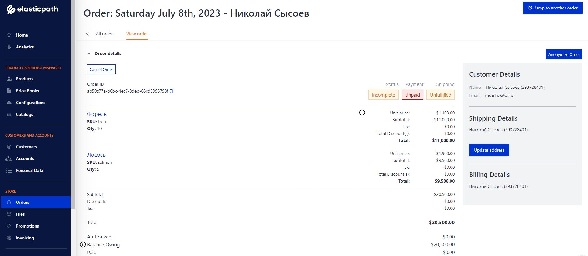
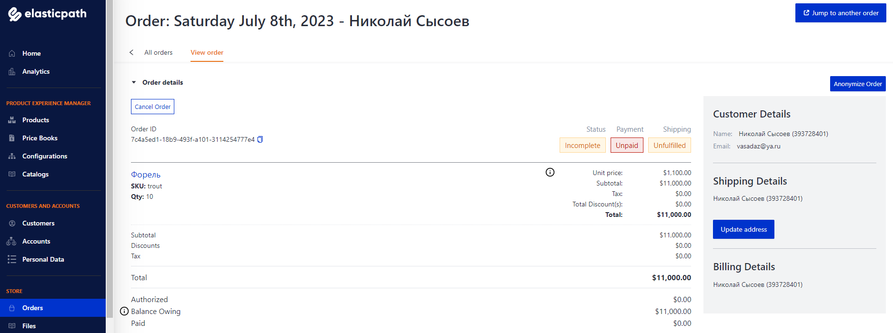

# Бот для продажи рыбы из магазина в [ElasticPath](https://www.elasticpath.com/)

Проект для продажи рыбы через Telegram бот из магазина в ElasticPath. 
Бот создаёт корзину для каждого пользователи, в которую кладутся товары. 
Также из корзины можно удалять не нужные товары и выполнять оплату.  
Во время оплаты бот просит, а после запоминает email пользователя.
После получения email бот создаёт заказ в магазине ElasticPath и очищает корзину.
Последующие оплаты бот не будет запрашивать email.

[Пример Telegram бота](https://t.me/DevmanLessonsBot)


Заказа в ElasticPath №1



Заказа в ElasticPath №2


## Как установить


1. Клонировать репозиторий:
    ```shell
    git clone https://github.com/Vasadaz/fish_bot.git
    ```

2. Установить зависимости:
    ```shell
    pip install -r requirements.txt
    ```

3. [Создать двух Telegram ботов](https://telegram.me/BotFather).
   - Первый бот будет основной для работы с пользователями;
   - Второй бот нужен для отправки сообщений об ошибках в основном боте.
   Его необходимо сразу активировать, т.е. инициализировать с ним диалог нажав на кнопку `СТАРТ(/start)`,
   иначе он не сможет отправлять вам сообщения.

4. 1. [Зарегистрируйтесь и создайте магазин с товарами в ElasticPath](https://useast.cm.elasticpath.com);
   2. [Создайте токен для приложения ElasticPath](https://useast.cm.elasticpath.com/application-keys);
   
5. [Создать БД Redis](https://developer.redis.com/create/redis-stack).

6. Создать файл `.env` с данными:
    ```dotenv
    ELASTIC_BASE_URL=https://useast.api.elasticpath.com # API Base URL из ключа приложения ElasticPath
    ELASTIC_CLIENT_ID=6UB...tJK # Client ID из ключа приложения ElasticPath
    ELASTIC_CLIENT_SECRET=5Bp...Hbn # Client Secret из ключа приложения ElasticPath
    REDIS_HOST=redis-564525.a12.us-east-1-2.ec2.cloud.redislabs.com # Хост для пдключения к БД Redis 
    REDIS_PASSWORD=NA7...ztX # Пароль root для аутентификации в БД Redis
    REDIS_PORT=564525 # Порт для пдключения к БД Redis 
    TELEGRAM_ADMIN_BOT_TOKEN=5934478120:AAF...4X8 # Токен бота Telegram для отправки сообщений об ошибках.
    TELEGRAM_ADMIN_CHAT_ID=123456789 # Ваш id Telegram, сюда будут отправлятся сообщения об ошибках.
    TELEGRAM_BOT_TOKEN=581247650:AAH...H7A # Токен основного бота Telegram.
    ```
   
7. Если необходимо, то замените [изображение логотипа](static/logo.png) и [корзины](static/cart.png) в директории `static`. 
   При этом имена изображений должны остаться прежними. 


7. Запуск ботов:
   - Telegram:
     ```shell
     python3 run_fish_bot.py
     ```

## Как запустить приложение в контейнере Docker

1. [Установить Docker Engine на сервер](https://docs.docker.com/engine/install/ubuntu/).

2. Перейти в директорию проекта `fish_bot`.

3. Соберите образ Docker:
    ```shell
    docker build -t fish_bot .
    ```

4. Запустите контейнер с образом devman_bot:
   ```shell
    docker run fish_bot
    ```

5. Теперь бот работает в своём контейнере Docker.


### Цель проекта

Код написан в образовательных целях на онлайн-курсе для веб-разработчиков [dvmn.org](https://dvmn.org/).

